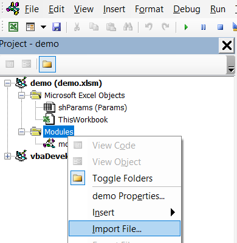
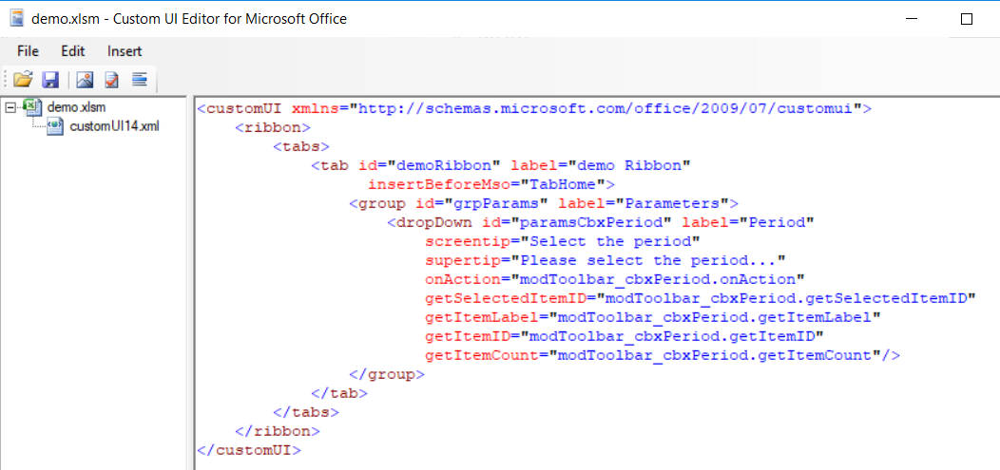
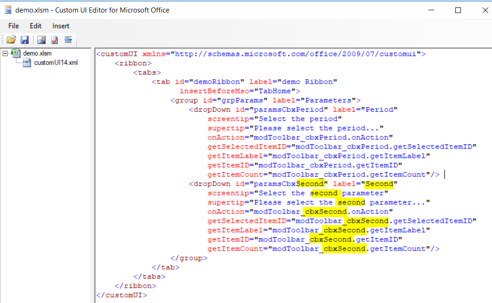

# Excel - VBA - Ribbon - Load dropdown from Excel's range

> How to very easily load an Excel range into the ribbon as a dropdown

The code provided in this repository will show you, very easily, how to use a range of your workbook as source data for a `dropdown` in a `ribbon` as show in the screen capture below :


The list of possible values are taken from a range like here below. That range can be anywhere in your workbook. Most of the time, you'll put such list in a hidden sheet.


By using the VBA code below, everything will be automatic :

* on the opening of the workbook, the ribbon will be initialized with the content of the range,
* if you add / edit / remove values in the list, just save and close the file then reopen it to update the ribbon (you can also add VBA code to `invalidate` the ribbon of course),
* by selecting a value from the dropdown, a name will be created / updated in the workbook so you can use that value in Excel's formulas,
* you'll be able to easily get the selected value in VBA.

## Table of Contents

- [Install](#install)
- [Usage](#usage)
- [Remarks](#remarks)
- [Author](#author)
- [License](#license)

## Install

You'll find in the `src` folder of this repository two files, the VBA module (`modToolbar_cbxPeriod.bas`) and the ribbon definition (`ribbon.xml`).

### modToolbar_cbxPeriod.bas

Get a copy of the `modToolbar_cbxPeriod.bas` file and import it into your Excel workbook

1. go to VBE (press `ALT-F11` to open the editor)
2. right-click on the `Modules`, select `Import File...` and import a copy of `modToolbar_cbxPeriod.bas`
	
3. Save and close the file

### Create the list

The `modToolbar_cbxPeriod` module will be used by the ribbon for, a.o.t, retrieve the content of a named range : you then need to create that range.

In your workbook, create a range with the desired values (in our example, a list of period).

For instance :


Give that range a name. In our example, the name is `_rngParamsPeriod`. If you wish to use another, just think to modify the line below from the module

```vbnet
Private Const cRangeName = "_rngParamsPeriod"
```

*Most of times, the range will be in a hidden sheet.*

### ribbon.xml

Get a copy of the `ribbon.xml` content (f.i. copy the content into the clipboard).

1. Start a ribbon editor like, for instance, [Custom UI Editor](http://openxmldeveloper.org/blog/b/openxmldeveloper/archive/2006/05/26/customuieditor.aspx) (that one or any other one)
2. Paste there the code for the ribbon
3. Save and close the file



## Usage

Just open your Excel file and, now, if everything was correctly installed, you'll have a ribbon with a dropdown and your values :


### More dropdowns

If you wish a second, third, ... dropdown, do this :

1. Duplicate the module and give another name (`modToolbar_cbxSecond`, `modToolbar_cbxThird`, ...)
2. Edit the duplicated module and be sure to change the two constants below by giving name names (`_rngParamsSecond` and `_Second`, ...)

```vbnet
Private Const cRangeName = "_rngParamsPeriod"

Private Const cName = "_Period"
```
3. Create new ranges in your Excel sheet with the list of values and give them the name you've mentioned in VBA (like `_rngParamsSecond`)
4. Edit your ribbon and duplicate the dropdown line, example below. Just change hightlight values.



## Remarks

* There is a limitation concerning the number of entries in a dropdown. I don't know the exact figure but if your list is made of more than ... items, Excel won't be able to load it and your dropdown will remains empty even when everyting was correctly coded. *(I've just tried right now with 1500 entries and it's too big)*

## Author

AVONTURE Christophe

## License

[MIT](LICENSE)